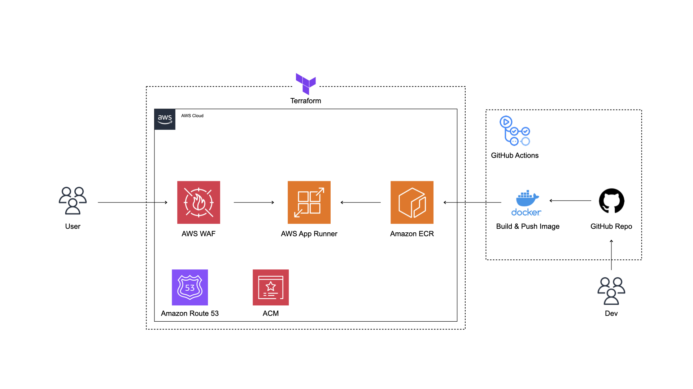

# Ryota Blog AWS Infrastructure with Terraform

This repository contains the Terraform configuration files to manage the following AWS services:

- AWS WAF
- AWS App Runner
- Amazon ECR (Elastic Container Registry)
- Amazon Route 53
- ACM (AWS Certificate Manager)

## Architecture Diagram

Below is the architecture diagram representing the infrastructure managed by this Terraform configuration:



## Prerequisites

Before using this Terraform configuration, ensure you have the following:

- [Terraform](https://www.terraform.io/downloads.html) installed on your local machine
- AWS CLI configured with the necessary permissions
- Access to the AWS account where you want to deploy the infrastructure

## Commands
### staging configuration
```sh
cd stg
```
```sh
terraform init
```

```sh
terraform plan -var-file=stg.tfvars
```
```sh
terraform apply -var-file=stg.tfvars
```

### production configuration
```sh
cd prd
```
```sh
terraform init
```
```sh
terraform plan -var-file=prd.tfvars
```
```sh
terraform apply -var-file=prd.tfvars
```

## Components

- **AWS WAF**: Protects your web applications from common web exploits.
- **AWS App Runner**: Provides a fully managed service for running containerized web applications and APIs.
- **Amazon ECR**: Stores and manages Docker container images.
- **Amazon Route 53**: Provides DNS web service.
- **ACM**: Manages SSL/TLS certificates for your AWS-based websites and applications.

## Variables

You can customize these variables by creating a `terraform.tfvars` file
